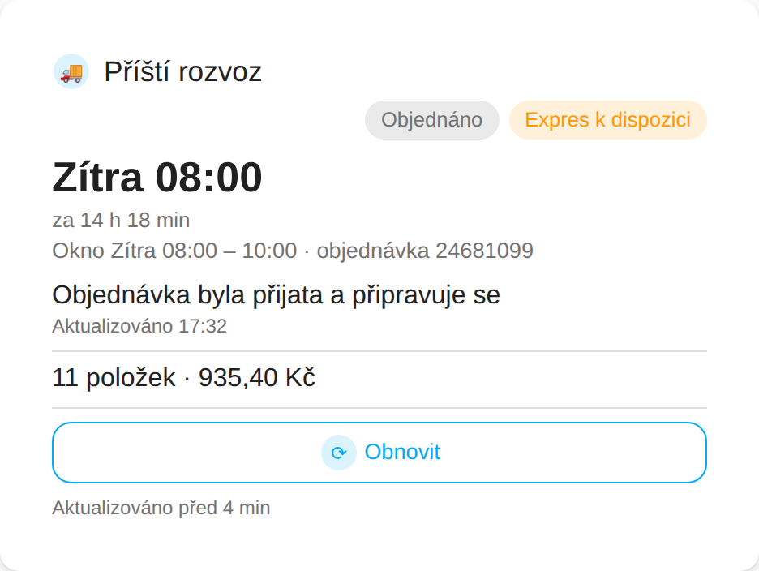
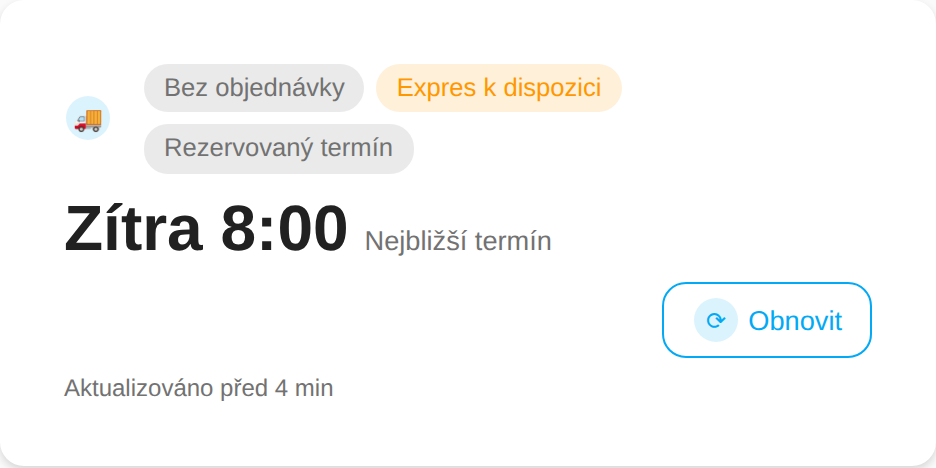
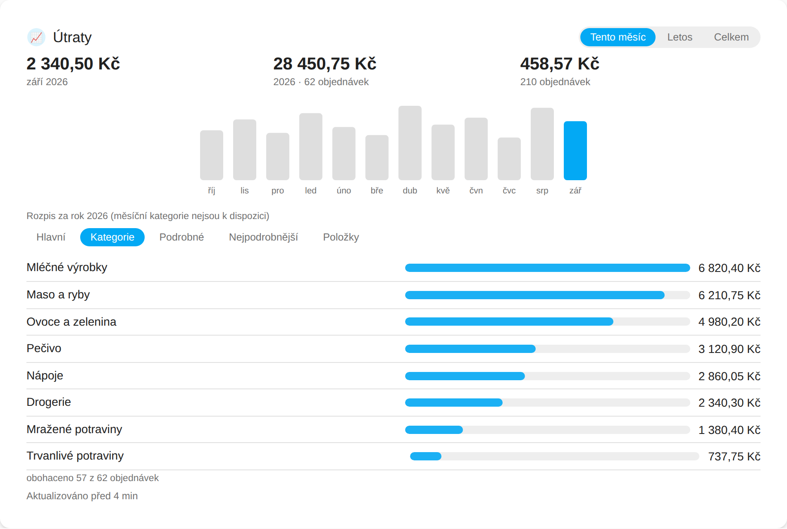

# Rohlík.cz Cards


Custom Lovelace cards and a badge for the
[HA-RohlikCZ](https://github.com/dvejsada/HA-RohlikCZ) Home Assistant integration —
next delivery status, your shopping cart, delivery slots, account details and
spending analytics, all rendered natively with your dashboard theme.


<details>
<summary>Phone width and dark theme</summary>


</details>

## Installation

### HACS (recommended)

1. In HACS, go to **Integrations → ⋮ → Custom repositories**.
2. Add this repository's URL with category **Dashboard**.
3. Install **Rohlík.cz Cards**, then reload your browser.

### Manual

1. Download `rohlik-cards.js` from the [latest release](../../releases/latest) (or `dist/`
   on `main`) and copy it into `<config>/www/rohlik-cards/`.
2. Add it as a Lovelace resource:

   ```
   /hacsfiles/rohlik-cz-HA-cards/rohlik-cards.js
   ```

   (or `/local/rohlik-cards/rohlik-cards.js` for a manual copy) as a **JavaScript module**.

## Cards

Every card takes a single `device` option: pick your Rohlík.cz account in the visual
editor and the card finds its entities itself, no entity IDs needed. All cards speak
Czech and English (`language: auto` follows your Home Assistant profile), use only your
theme's colours, adapt to their own width on phones, and show an "updated N min ago"
footer that turns amber when the integration stops refreshing.

The renders below come from the bundled preview harness with sample data
(`npm run screenshots`); the layout and copy are exactly what the cards produce.

### Next Delivery — `rohlik-delivery-card`


One card, four states. **Ordered**: the delivery window with a countdown. **On the
way**: the live ETA as the headline, a progress track across the window, the courier's
announcement and the order summary. **Delivered**: the last order and an "order again"
link. **No order**: the nearest available slot, reserved-slot and express chips, and up to
three upcoming slots with prices.

 

A matching **badge**, `rohlik-delivery-badge`, shows the same state in one line at the
top of a view:


Options: `show_announcement`, `show_order_summary`, `show_express_chip`, `show_refresh`,
`show_slots`, `show_shop_link`, `compact`, `tap_action`. Full reference in
[docs/cards/delivery-card.md](docs/cards/delivery-card.md).

### Shopping Cart — `rohlik-cart-card`


Your live cart as product rows with a quantity stepper and remove button, the total and
item count, and an inline search box: results float over the page, `+` or Enter adds a
product (type `3 rohlíky` to add three), a heart limits results to favourites. The
**Order** button opens your Rohlík.cz cart in a new tab. Set `min_order` to get an
"Above/Below minimum" chip and how much is missing; Xtra no-limit orders count as above.
Long carts scroll inside the card (`list_max_height`).

Options: `show_search`, `group_by_category`, `show_brand`, `max_items`, `list_max_height`,
`min_order`, `show_order_button`, `checkout_url`. Reference:
[docs/cards/cart-card.md](docs/cards/cart-card.md).

### Delivery Slots — `rohlik-slots-card`


The nearest Express, Standard and Eco slots with time, window, price and a capacity bar
that turns amber and red as a slot fills. The eye button switches on **watch mode**,
which polls the integration's cheap `refresh_slots` action every few seconds while the
page is visible, so the "Express available" chip flips the moment a slot opens. Tiles sit
side by side in a wide card and stack into compact rows in a narrow one.

Options: `slots`, `layout` (`auto`, `row`, `column`), `show_price`, `show_location`,
`watch_interval`. Reference: [docs/cards/slots-card.md](docs/cards/slots-card.md).

### Account — `rohlik-account-card`


Xtra membership with days remaining, credit, reusable bags and deposit, remaining
no-limit and free-express orders (hidden when you are not a member), Parents Club, the
last order, and a refresh button that triggers a full integration update.

Options: `stats` (which tiles, in which order), `show_footer`. Reference:
[docs/cards/account-card.md](docs/cards/account-card.md).

### Spending — `rohlik-spending-card`


Month, year and all-time totals with order counts and the average order value, a
by-year chart, and a breakdown by category level or by product from the integration's
opt-in **Spending Analytics** sensors (tap a row for units and price per unit). The
**This month** period swaps the chart for the last twelve months, read from Home
Assistant's long-term statistics of the monthly-spent sensor.



Options: `default_period` (`month`, `year`, `all`), `default_level`, `top_n`, `chart`
(`auto`, `years`, `months`, `none`), `show_totals`. Reference:
[docs/cards/spending-card.md](docs/cards/spending-card.md).

Quick start — add a card via **Edit dashboard → Add card → Rohlík.cz Next Delivery**,
or in YAML:

```yaml
type: custom:rohlik-delivery-card
device: 0123456789abcdef0123456789abcdef   # your Rohlík.cz device id
```

See [docs/DESIGN.md](docs/DESIGN.md) for the full data contract and per-card
specification.

## Testing before publishing (sideload)

You can try the cards on your own Home Assistant instance without HACS:

1. Download [`dist/rohlik-cards.js`](dist/rohlik-cards.js) from this repository
   (the **Raw** button, or `curl -L https://raw.githubusercontent.com/dvejsada/rohlik-cz-HA-cards/main/dist/rohlik-cards.js -o rohlik-cards.js`).
2. Copy it to `<config>/www/rohlik-cards/rohlik-cards.js` on your Home Assistant host
   (create the `www` folder if it does not exist; the Samba, SSH or File editor add-ons all work).
3. In Home Assistant go to **Settings → Dashboards → ⋮ (top right) → Resources → Add resource**,
   enter `/local/rohlik-cards/rohlik-cards.js?v=1` and choose **JavaScript module**.
   (Resources are only visible when *Advanced mode* is on in your user profile.)
4. Hard-refresh the browser (Ctrl+Shift+R / Cmd+Shift+R). The cards now appear under
   **Add card** as *Rohlík.cz Next Delivery*, *Rohlík.cz Shopping Cart* and so on, and the
   browser console prints a `ROHLIK-CARDS` banner with the version.
5. To update, overwrite the file and bump the `?v=` number in the resource URL so the
   browser does not serve the cached copy.

Alternatively add this repository to HACS as a **custom repository** with category
**Dashboard**: HACS then downloads `dist/rohlik-cards.js` straight from the default
branch and registers the resource for you, no release needed.

For development against a live integration without touching your real instance, see the
throwaway Home Assistant container in [docs/dev/README.md](docs/dev/README.md).

## Requirements

These cards require the [HA-RohlikCZ](https://github.com/dvejsada/HA-RohlikCZ)
integration, version **1.0.0 or newer**, configured and running in your Home
Assistant instance.

## Development

```bash
npm install
npm run dev        # rollup --watch
npm run build      # dist/rohlik-cards.js (minified, no sourcemap)
npm run lint        # eslint src
npm run typecheck   # tsc --noEmit
npm test            # vitest run
npm run format       # prettier --write .
```

See [docs/dev/README.md](docs/dev/README.md) for a throwaway Home Assistant
container to try cards against a live `rohlikcz` integration while developing.

**Preview harness.** `npm run build && npm run screenshots` loads the built
`dist/rohlik-cards.js` in headless Chromium against a mocked `hass`
(`docs/dev/preview/`, no live Home Assistant needed) and regenerates every PNG
under `docs/images/`, including this README's overview. Open
`docs/dev/preview/index.html` yourself (served over `http(s)`, not `file://`,
so the module import resolves) to poke at a card live; `?lang=en`, `?theme=dark`
and `?state=arriving|ordered|none|delivered` switch the mock's scenario.

## License

MIT — see [LICENSE](LICENSE).
