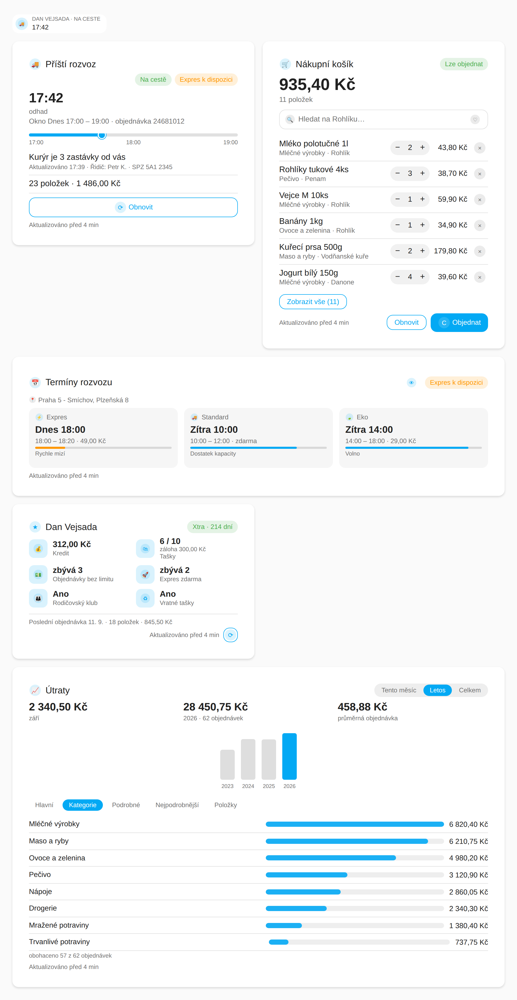
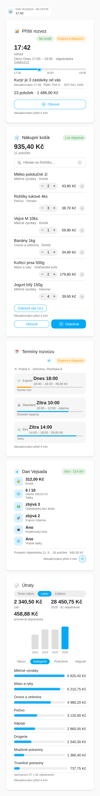
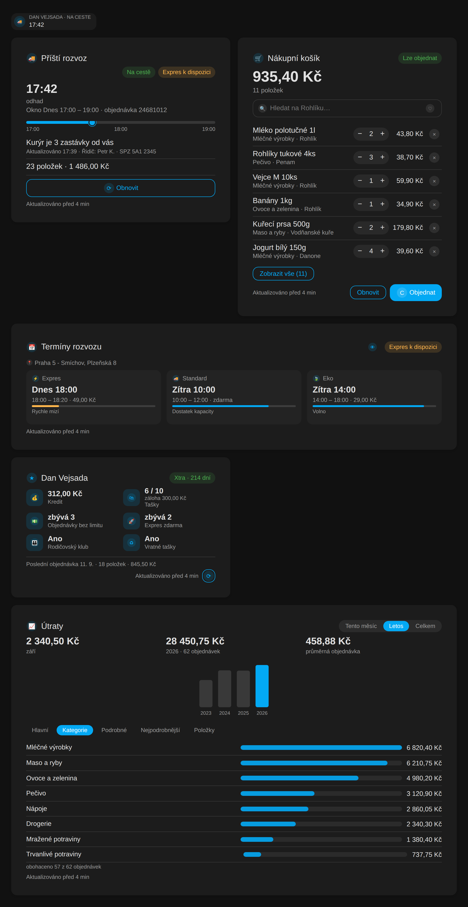
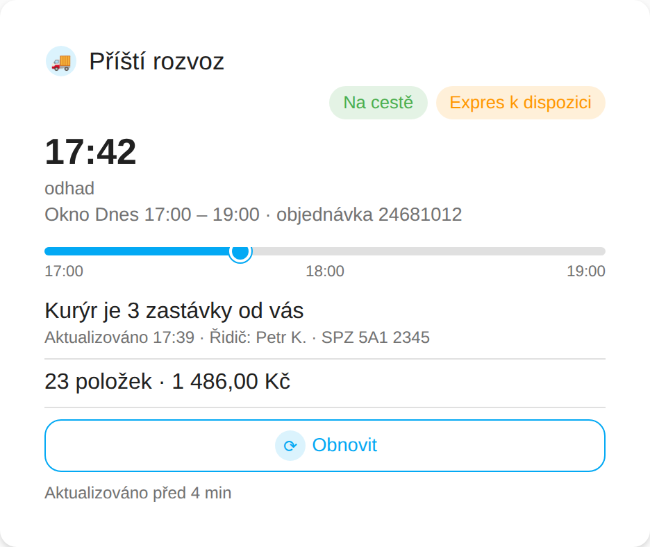
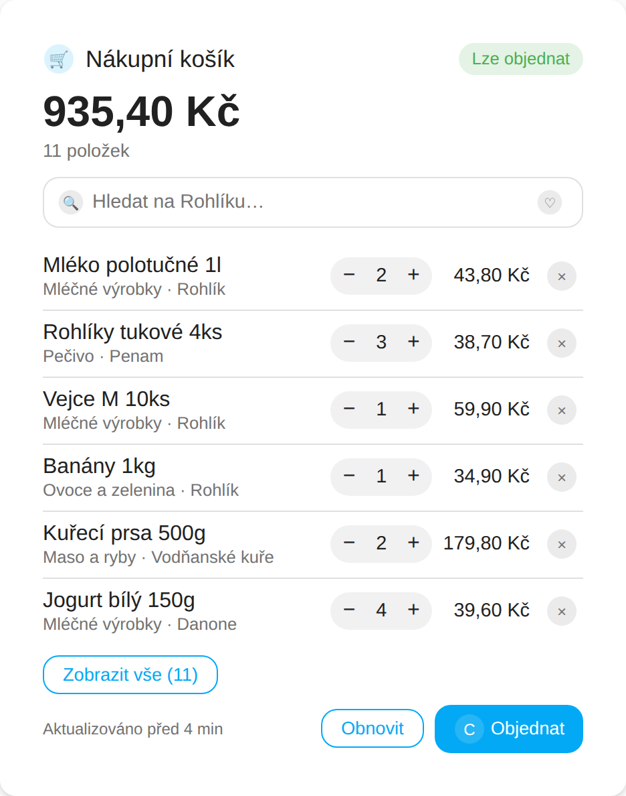
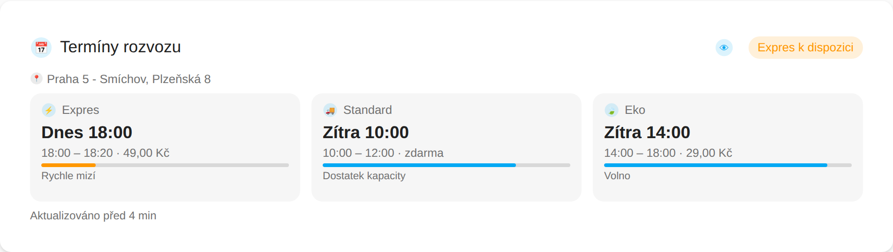
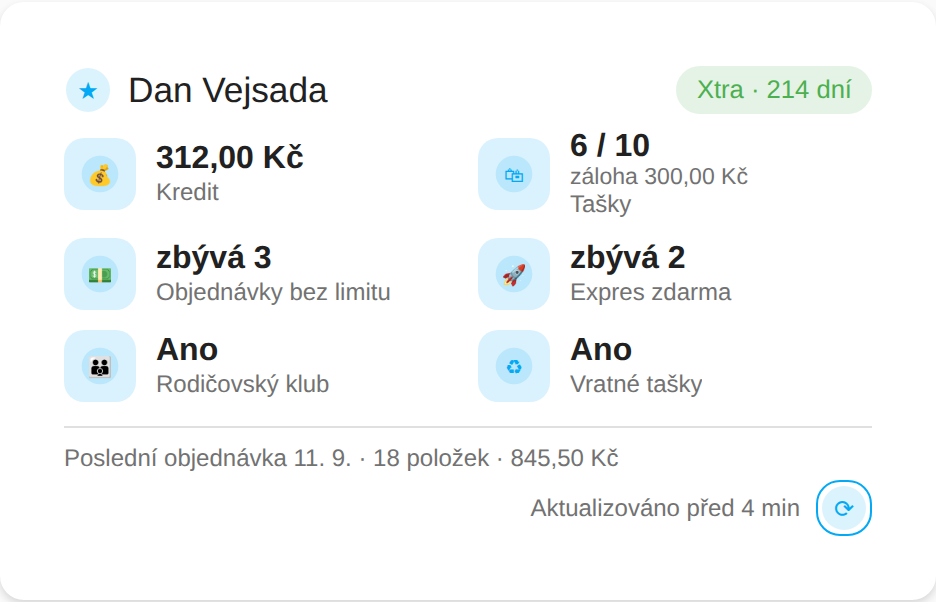
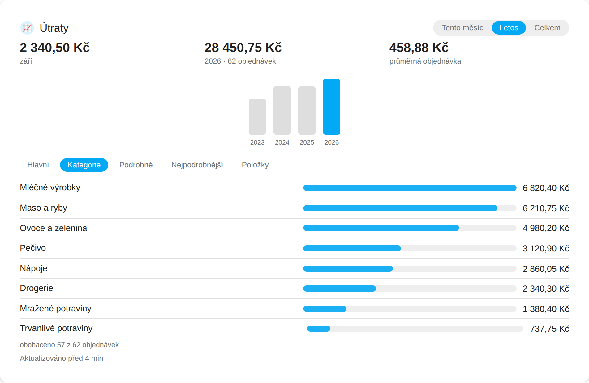
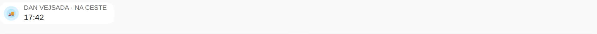

# Rohlík.cz Cards


Custom Lovelace cards and a badge for the
[HA-RohlikCZ](https://github.com/dvejsada/HA-RohlikCZ) Home Assistant integration —
next delivery status, your shopping cart, delivery slots, account details and
spending analytics, all rendered natively with your dashboard theme.



<details>
<summary>Phone width and dark theme</summary>




</details>

## Installation

### HACS (recommended)

1. In HACS, go to **Integrations → ⋮ → Custom repositories**.
2. Add this repository's URL with category **Dashboard**.
3. Install **Rohlík.cz Cards**, then reload your browser.

### Manual

1. Download `rohlik-cards.js` from the [latest release](../../releases/latest) (or `dist/`
   on `main`) and copy it into `<config>/www/rohlik-cards/`.
2. Add it as a Lovelace resource:

   ```
   /hacsfiles/rohlik-cz-HA-cards/rohlik-cards.js
   ```

   (or `/local/rohlik-cards/rohlik-cards.js` for a manual copy) as a **JavaScript module**.

## Cards

| Custom element              | Card            | Docs                                                    |
|------------------------------|-----------------|----------------------------------------------------------|
| `rohlik-delivery-card`       | Next Delivery   | [docs/cards/delivery-card.md](docs/cards/delivery-card.md) |
| `rohlik-delivery-badge`      | Delivery badge  | [docs/cards/delivery-card.md#badge](docs/cards/delivery-card.md#badge--rohlik-delivery-badge) |
| `rohlik-cart-card`           | Shopping Cart   | [docs/cards/cart-card.md](docs/cards/cart-card.md) |
| `rohlik-slots-card`          | Delivery Slots  | [docs/cards/slots-card.md](docs/cards/slots-card.md) |
| `rohlik-account-card`        | Account         | [docs/cards/account-card.md](docs/cards/account-card.md) |
| `rohlik-spending-card`       | Spending        | [docs/cards/spending-card.md](docs/cards/spending-card.md) |

<table>
  <tr>
    <td></td>
    <td></td>
  </tr>
  <tr>
    <td></td>
    <td></td>
  </tr>
  <tr>
    <td></td>
    <td></td>
  </tr>
</table>

Quick start — add a card via **Edit dashboard → Add card → Rohlík.cz Next Delivery**,
or in YAML:

```yaml
type: custom:rohlik-delivery-card
device: 0123456789abcdef0123456789abcdef   # your Rohlík.cz device id
```

Every card takes a single `device: <device_id>` option — pick the Rohlík.cz device
in the visual editor, no entity IDs required. See [docs/DESIGN.md](docs/DESIGN.md)
for the full data contract and per-card specification.

## Testing before publishing (sideload)

You can try the cards on your own Home Assistant instance without HACS:

1. Download [`dist/rohlik-cards.js`](dist/rohlik-cards.js) from this repository
   (the **Raw** button, or `curl -L https://raw.githubusercontent.com/dvejsada/rohlik-cz-HA-cards/main/dist/rohlik-cards.js -o rohlik-cards.js`).
2. Copy it to `<config>/www/rohlik-cards/rohlik-cards.js` on your Home Assistant host
   (create the `www` folder if it does not exist; the Samba, SSH or File editor add-ons all work).
3. In Home Assistant go to **Settings → Dashboards → ⋮ (top right) → Resources → Add resource**,
   enter `/local/rohlik-cards/rohlik-cards.js?v=1` and choose **JavaScript module**.
   (Resources are only visible when *Advanced mode* is on in your user profile.)
4. Hard-refresh the browser (Ctrl+Shift+R / Cmd+Shift+R). The cards now appear under
   **Add card** as *Rohlík.cz Next Delivery*, *Rohlík.cz Shopping Cart* and so on, and the
   browser console prints a `ROHLIK-CARDS` banner with the version.
5. To update, overwrite the file and bump the `?v=` number in the resource URL so the
   browser does not serve the cached copy.

Alternatively add this repository to HACS as a **custom repository** with category
**Dashboard**: HACS then downloads `dist/rohlik-cards.js` straight from the default
branch and registers the resource for you, no release needed.

For development against a live integration without touching your real instance, see the
throwaway Home Assistant container in [docs/dev/README.md](docs/dev/README.md).

## Requirements

These cards require the [HA-RohlikCZ](https://github.com/dvejsada/HA-RohlikCZ)
integration, version **1.0.0 or newer**, configured and running in your Home
Assistant instance.

## Development

```bash
npm install
npm run dev        # rollup --watch
npm run build      # dist/rohlik-cards.js (minified, no sourcemap)
npm run lint        # eslint src
npm run typecheck   # tsc --noEmit
npm test            # vitest run
npm run format       # prettier --write .
```

See [docs/dev/README.md](docs/dev/README.md) for a throwaway Home Assistant
container to try cards against a live `rohlikcz` integration while developing.

**Preview harness.** `npm run build && npm run screenshots` loads the built
`dist/rohlik-cards.js` in headless Chromium against a mocked `hass`
(`docs/dev/preview/`, no live Home Assistant needed) and regenerates every PNG
under `docs/images/`, including this README's overview. Open
`docs/dev/preview/index.html` yourself (served over `http(s)`, not `file://`,
so the module import resolves) to poke at a card live; `?lang=en`, `?theme=dark`
and `?state=arriving|ordered|none|delivered` switch the mock's scenario.

## License

MIT — see [LICENSE](LICENSE).
